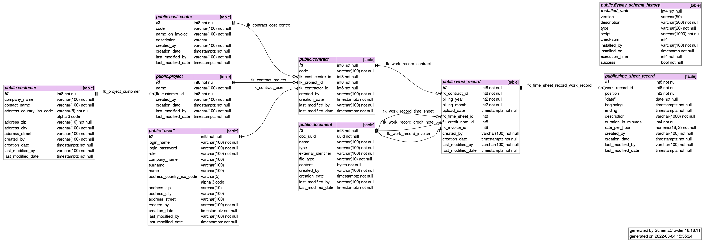

# de.denktmit.tam

Web application to process time and material records

## Start hacking
application-develop:
run develop db: docker-compose -f docker-compose-develop.yaml up -d

application-test:
run test db: docker-compose -f docker-compose-IT.yaml up -d

## Build
Maven build automatically runs IT tests against integration test db (docker-compose-IT.yaml)

## Autogenerate DB Schema
Run SchemaCrawler in Docker against docker instance name "tam-develop-pg", which should be started manually Automatically updates dbschema.png:

./runMermaid.sh

